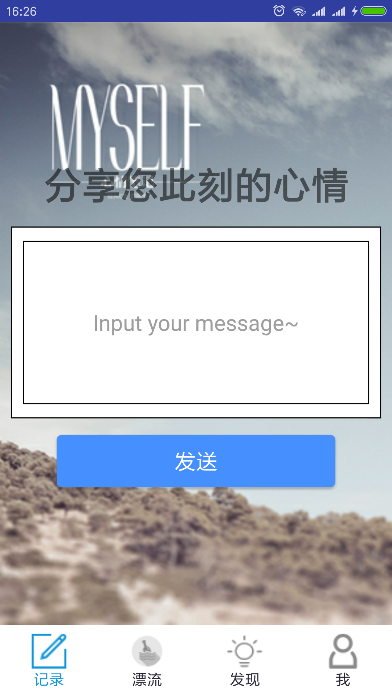
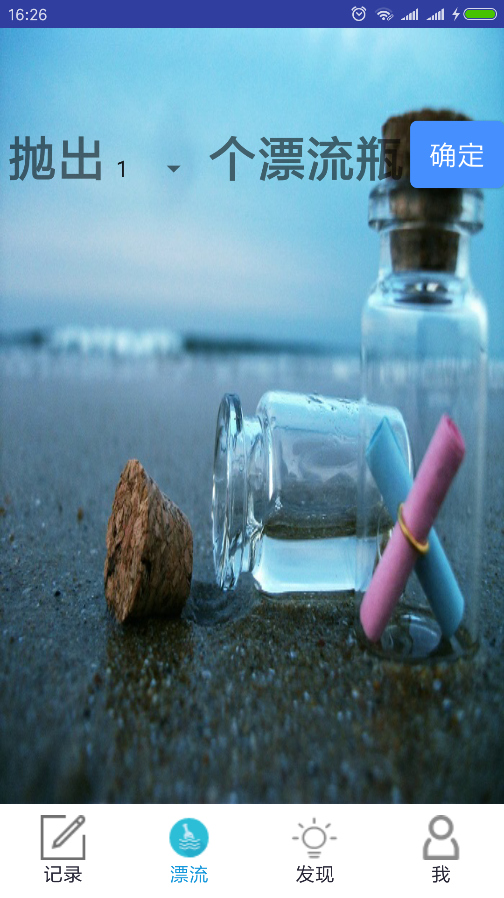
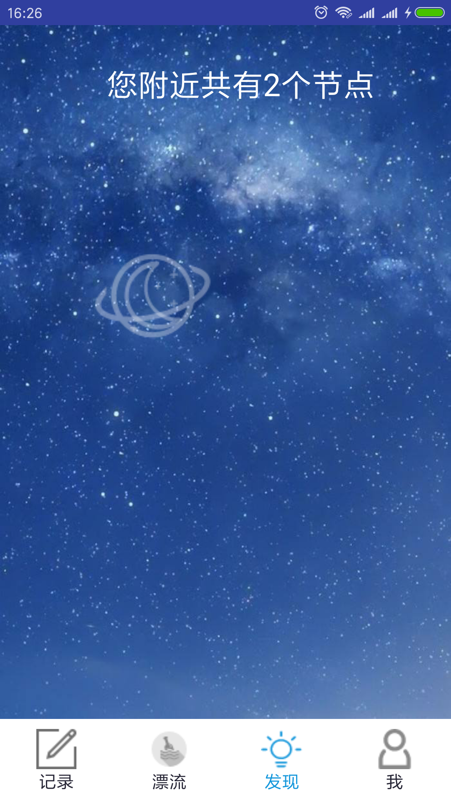
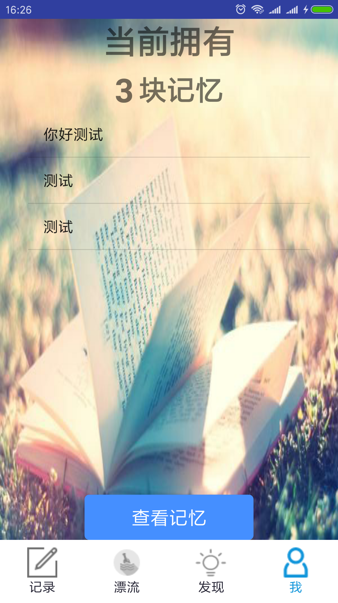

# Drifting
基于区块链的心情漂流APP

通过Python实现了一个简单的区块链，利用Flask开发了一个简单的web应用，为APP提供接口。APP通过`POST`和`GET`的方式获取和上传数据。

### 开发工具

Android Studio 3.0

Pycharm

Python 3.5

### Blockchain相关接口

#### 1.http://host:port/mine

​	在APP中存入心情【message】的方式就是进行挖矿，把数据存入区块中。

#### 2.http://host:port/chain

​	在APP中通过`GET`的方式，获取整条链，从中提取出自己的message。

#### 3.http://host:port/transation/new

​	进行交易，在APP中通过中方式交换心情。

#### 4.http://host:port/nodes/register

​	注册节点

#### 5.http://host:port/nodes/resolve

​	共识算法，解决冲突

### Android界面展示

 

------

### Issues_20180605

1.APP功能当前只是使用了本地链的功能，只是调用了接口1，2

2.APP第二页的漂流功能暂时没有实现

3.APP第三页的节点显示由于暂时没有利用节点注册与共识算法，只是固定显示两个节点

4.最后一页查看记忆，显示的是链上的所有信息，暂时没有做区分处理

